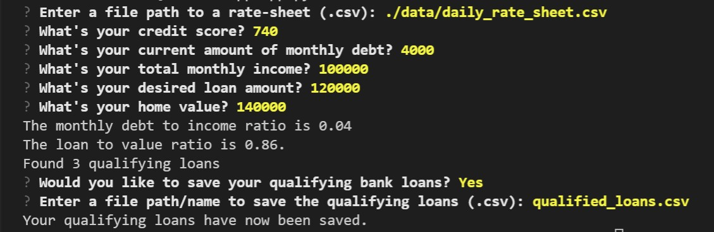

# Loan Qualifier Application
FinTech Module 2 Challenge

This is a command-line interface application for determining which loans the user qualifies for. The application works by taking in a `daily_rate_sheet` file  that has loan criteria from various loan providers, asking the user a number of questions to evaluate their loan eligibility, returning to them a list of qualifying loans, and allowing the user to save their results.

---

## Dependencies
This project leverages python 3.8 with the following packages:

* [fire](https://github.com/google/python-fire) - For the command line interface, help page, and entry-point.

* [questionary](https://github.com/tmbo/questionary) - For interactive user prompts and dialogs
---
## Clone Guide
 In the terminal, navigate to directory where you want to clone the repository and enter the following command
```
git clone https://github.com/dcmar18/LoanQualifierApp.git
```

---
## Usage
To use the loan qualifier application clone the repository and run the **app.py** with:

```
python app.py
```


---
## Contributers

- Daniel Martinez
